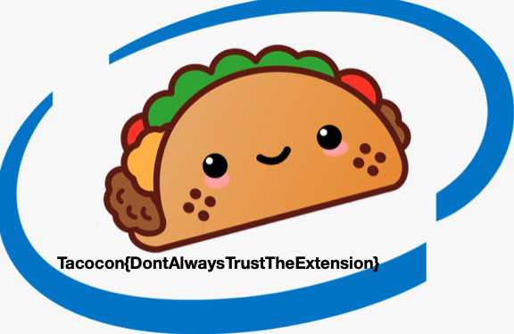
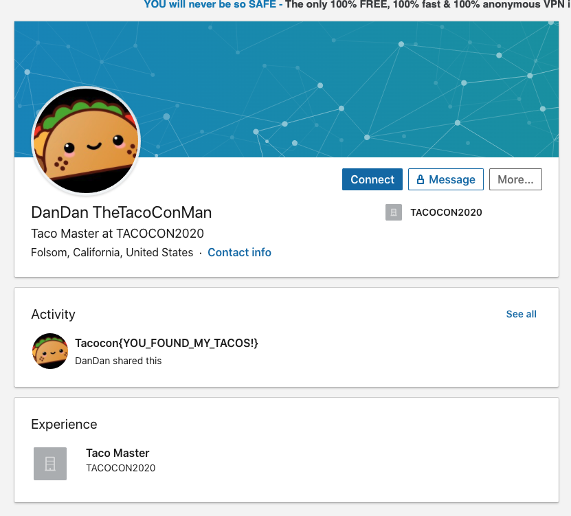

# Solutions

## crypto-101
You are given the following string `VGFjb2NvbntUaGlzSXNUaGVGbGFnISF9Cg==`

This is a base64 encoded string. Some ways to identify this:
* Length is a multiple of 4
* Many times base64 strings end in = as they are used to pad the string (to ensure length is multiple of 4)
* Limit character set of a-z,A-Z,0-9,+,/,=

So to decode, use an online base64 decoder or from bash
`echo 'VGFjb2NvbntUaGlzSXNUaGVGbGFnISF9Cg==' | base64 -d`

Gives `Tacocon{ThisIsTheFlag!!}`

## steg-101
You are given a JPG file. Opening it just shows an image of a person eating a taco, but based on the name of the challenge, this is a stegnography challenge.

A lot of the time, solving stego challenges requires finding the right tool because there are a bunch out there. 

If go through the tools on [this stego toolkit list](https://github.com/DominicBreuker/stego-toolkit), one of them `steghide` will get you the flag.

Running the command `steghide extract -sf taco_eating.jpg` with no passphrase gives you the flag `TacoCon{namNAMnamNAMnamNAM}`

## forensics-101
You are given a .TXT file. If you open it, you are met with a bunch of gibbersh. Looking at the first line, you can see the string `PNG` hinting that this may not actually be a txt file.

If you check the file type using the `file` command in bash, you find out that this is a PNG file.

Modifying the extension from `txt` to `png` and opening the file, gives you an image with the flag inside. 

## web-101
You are given a url `http://challenges.tacocon.party:8100`. Navigating to it reveals a webpage with an image background and some text saying `Tacos are my favorite food!`

To find the flag, you just need to inspect the source of the webpage, and you will find an HTML comment in the source that has the flag. `Tacocon{AlwaysCheckTheSourceCode}`

## reverse-101
You are given a binary file that when run prints out `I love tacos!`.

You have a few options for solving this one. You could try throwing it into a tool that can do dissambley like Ghidra. 

A simpler option would to check the binary file for any interesting strings using the bash command `strings`
`strings i_love_tacos | grep Tacocon`

These work because if you look at the source code, the flag string was hardcoded and when compiled, it is left there as data.

Either of these should give the flag `Tacocon{YouFoundMe!!}`

## network-101
You are given a hostname and a port. If you try to navigate to that via a web browser, no information is return indicating that the port does not support HTTP requests.

You need to find an alternative way to interact with this port. There are many tools for connecting directly to a port (sockets, telnet, netcat, etc)

Connecting to the port with one of these reveals the flag. `nc challenges.tacocon.party 6543`
`Tacocon{HelloFromTheOtherSideOfTheInternet}`

## Hidden Tacos
You are given a zip file. When you unzip it (`unzip hidden_tacos.zip -d hidden_tacos`) and look inside (`ls hidden_tacos`), the directory appears empty.

However, if you look at the unzip output, you can see some directories being extracted starting with a `.` indicating they are hidden. If you view the hidden_tacos directory again with `ls -a`, you can see the `.tortilla` directory exists. Navigating through the nested hidden directories, you will find the flag. `TacoCon{N0t_Qu1t3_3mpty_4tf3r_A11}`

## Find the Taco!
As the challenge explains, this requires using OSINT or open-source intelligence. This means taking the information we know and searching openly available Internet sources for more details. Data sources can be social media, blogs, school pages, etc.

The only info we have to go off is a name ` DanDan TheTacoConMan`

One simple option is to google the name and see what we get back. Doing this, returns a Linkedin profile. You probably will have to sign in to view it. 

Alternatively, if you didn't find the page via Google, a common OSINT strategy is to check different popular social media platforms to find more info. So searching for DanDan TheTacoConMan via Linkedin's search would yield the same page.

On the profile, you can see the profile has posted a status containing the flag. `Tacocon{YOU_FOUND_MY_TACOS!}`

## vi
You are given a private key that you can use to SSH into the server on port 2222. 

If you try to use the private key after downloading with ssh, you may get an error saying the permissions on your key are too lax. You need to modify the key to be readable only by the owner (you). This is important because private keys are very sensitive and if someone gets a hold of yours, they can now impersonate you whever that key is used to authenticate. `chmod 600 tacocon.key`

Once you are logged on to the server, you find yourself seeing a message. The final line of the message says `Can you escape from vi?`.

This indicates that you are within a vi session. vi is a text editor. You can see you can't edit the file as it's read only, and there's no command injection available.

Based on the last sentence, you need to find a way to get out of vi. So doing some research about vi, you can find that you can exit by being in command mode (typically you hit ESC), and then running the command `:q` to quit.

Doing this spits out the flag `Tacocon{Over_2_Million_People_Have_Gotten_Trapped_In_Vi}`