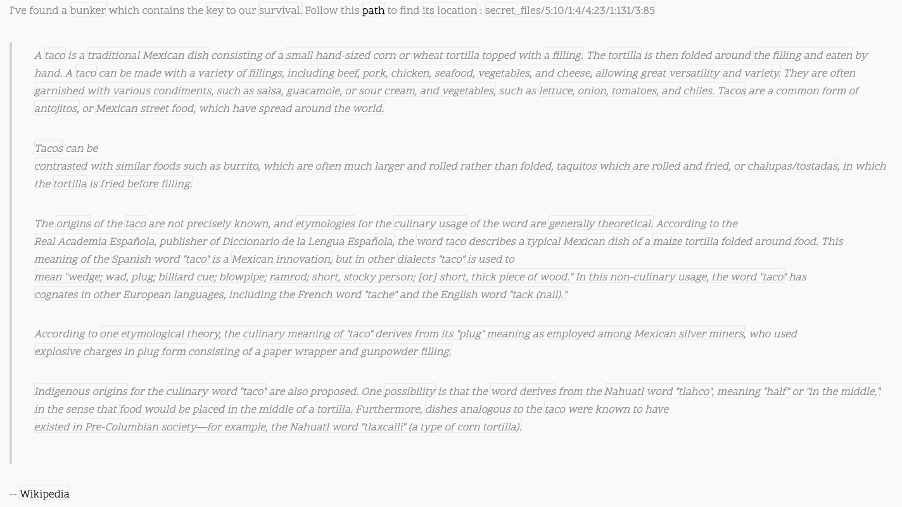

# Challenge_Zero Solution

## Secret Message
You are given a binary string. If you decode that using an online tool such as CyberChef, you back a url `http://challenges.tacocon.party:6789`

## Redacted Text
Navigating to the website, you find a bunch of text that is redacted with a Classified stamp on top

The first step is finding a way to read the text. You can inspect the page source, and you can see the plain text. There are a a lot of  tags in the way, making it a little hard to read.

One option is to pull the page source down manually and or with curl (`curl http://challenges.tacocon.party:6789 > source.html`) and find/replace all the spans to make it more readable.

A second option is you can try seeing if you can copy/paste the text straight from the page. However, the Classified stamp gets in the way. To get around it, you can use the `Inspect Element` feature of browsers like Chrome & FireFox, find where the image is being loaded in the source, and delete the img tag.

Then you should be able to highlight the text and copy it to a text editor on your computer without the redactions.

Your third option is to find a way to disable the redactions on the webpage. From looking at the source code, all the redacted parts of text are wrapped in  tags, and each paragraph is wrapped in 
 tags with the class of `redacted` set. So if you inspect the source again with your web browser, and find one of the redacted pieces of text, you will find that there's a CSS `::after` selector following each redacted text. If you click on that, you can see the CSS being applied, and from the web tools, you can disable the black background. 

## Decoding the Cipher
Reading the un-redacted text now, you are given a strange message at the beginning of the paragraph `Follow this path to find its location : secret_files/5:10/1:4/4:23/1:131/3:85`

The word **path** is emphasized, hinting that there is some potential web path you need to go to, but there appears to be some sort of code. If you check out the path `http://challenges.tacocon.party:6789/secret_files`, you find yourself looking at a directory listing with a bunch of single letter directories. Navigating into a folder leads to more single letter directories, and eventually you can reach the end of a path after 5 letters. So knowing this information, we're looking for some combination of letters that leads up to the right path.

The intended way to find this path is to figure out the cipher in the message. We know from looking at secret_files that each #:# pair corresponds to a single letter. The cipher being used here is a type of [book cipher](https://www.boxentriq.com/code-breaking/book-cipher). Book ciphers can vary a bit, but generally the first number corresponds to a page number and the second number corresponds to the word at that position on the page. However, we don't have a book in this case, and instead we have some paragraphs of information from Wikipedia. In this case, the first number corresponds to the paragraph in the blockquote, and the second number corresponds to the letter in the given paragraph (spaces count). 

So following this logic, you find the cipher decodes to `secret_files/s/a/l/s/a`, so traveling to that path reveals another webpage: `http://challenges.tacocon.party:6789/secret_files/s/a/l/s/a/bunker_locator.html`!

There is another unintended way you could find this path without solving the cipher. You could write a script to go through each directory under secret_files until you find something interesting. In this case, we did ask people not to bruteforce anything to prevent overloading the server, but there actually aren't that many directories to check (only *228,488*), so it could have worked.

## Bunker Locator
Now looking at bunker_locator.html, we see some text being written to the screen. Once you wait for it finish, you are met with an ASCII art of a flaming taco and a message saying `Location Found! Stored agent message at /{location_name}.html|`

If you try that path as is, it doesn't work, so we need to figure out the location name. The page says it found the bunker location, but nothing is printed out. So it must have put the location somewhere else. If you check out the page using the browswer web tools again, you can find some Javascript that writes the following message to the Javascript console of the page `Location at : 13.507993, 144.804185`

## Finding the Location
So those numbers are not a name but actually longitude, latitude coordinates. This is where we need to see what we can find from looking around on the Internet! Taking those coordinates and plugging them into Google Maps, you can find the following image, showing what locations are at these coordinates. There are a handful, but knowing that this is **Taco**Con, we can make a guess that the location we want is `Tacos Sinaloa`.

Now, playing around with the name format, you will eventually find the path `http://challenges.tacocon.party:6789/Tacos_Sinaloa.html` to be correct, and you are met with the message from the T.A.C.O. agent and an image showing the flag!

