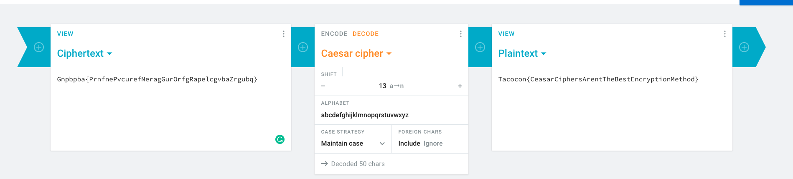
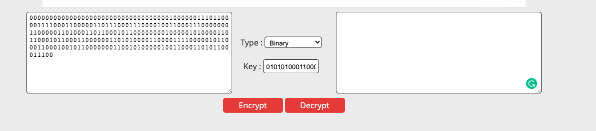
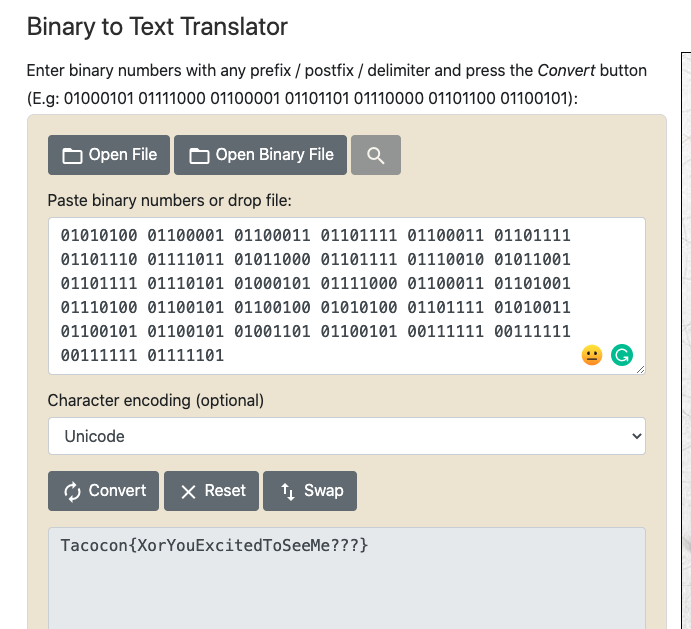
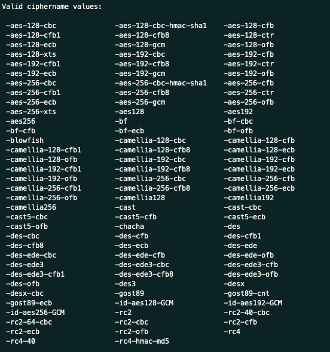
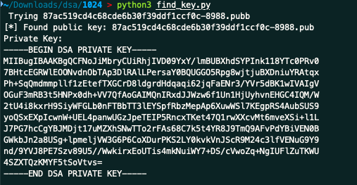
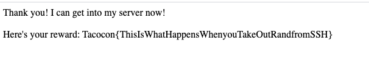
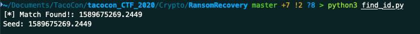

# Crypto Solutions

## Table of Contents

  * [Crypto 100 - Intercepted Message](#crypto-100---Intercepted-Message)
  * [Crypto 200 - Binary Cipher Text???](#crypto-200---binary-cipher-text)
  * [Crypto 300 - TacosTacosTacos](#crypto-300---tacostacostacos)
  * [Crypto 400 - SSH Keys](#crypto-400---ssh-keys)
  * [Crypto 500 - File Recovery](#crypto-500---file-recovery)

## Crypto 100 - Intercepted Message

This challenge is a ROT13 cipher, otherwise known as a ceasar cipher. 

Easiest way to decrypt this is use an online decryptor. [Here](https://cryptii.com/pipes/caesar-cipher) is a good one.



## Crypto 200 - Binary Cipher Text???

This challenge is an XOR cipher. 

Again, easiest way to solve this is to plug in the cipher text and key into a website. 

Due to the lengths of the two binary strings, we know that this is the cipher text:  
```
0000000000000000000000000000000000010000001110110000111100011000001101110001110000100110001110000000110000011010001101100010110000000010000010100001101100010110001100000011010100001100001111000001011000110001001011000000011001010000010011000110101100011100
```

And this is the key:
```
0101010001100001011000110110111101110011
```

Stick this information into an [online decryptor](https://md5decrypt.net/en/Xor/#results): 



This returns another binary string: 

```
0101010001100001011000110110111101100011011011110110111001111011010110000110111101110010010110010110111101110101010001010111100001100011011010010111010001100101011001000101010001101111010100110110010101100101010011010110010100111111001111110011111101111101
```

Take the decrypted binary string an put it into an online [binary to text translator](https://www.rapidtables.com/convert/number/binary-to-ascii.html): 



## Crypto 300 - TacosTacosTacos

This challenge focuses on finding the right cipher to decrypt the cipher text. In the challenge, the encryption key is already provided: `TacosTacosTacos`, but the cipher used for encryption is not known. 

It is possible to list all of the ciphers supported by openssl with the command: `openssl enc -h`



Put the entire list of these ciphers into a text file and then write a simple bash script to loop through them, trying to decrypt with each cipher type. 

One of them should give you the flag. 

```bash
while read cipher; do
  openssl enc -d $ciper -in flag -out "$cipher.txt" -a -k TacosTacosTacos
done <ciphers.txt
```

**Depending on the version of openssl, you may need to specify the digest to use MD5 - this is done with `-md md5`**

The cipher used was `camellia-256-cfb8`.

```bash
openssl enc -d -camellia-256-cfb8 -in flag -out flag-d.txt -a -k TacosTacosTacos
```

Which gives you: `Tacocon{AES_aint_the_only_cipher_out_there}`

## Crypto 400 - SSH Keys 

This challenge focuses on an old vulnerability in the generation of SSH Keys. To sum it up, the randomness of the SSH key generation was not as random as it should have been. This was due to a feature they tried to implement to make generation faster. This vulnerability made it so that only a limited number of ssh keys were generated while this feature was implemented. 


The best place to read about this vulnerability is [here](https://github.com/g0tmi1k/debian-ssh)

On this webpage, there is a list of "common keys" provided. Looking at the common_keys directory there are two zip files. One for ssh rsa keys and another for ssh dsa keys. 

Looking at the public key provided: 
```
ssh-dss AAAAB3NzaC1kc3MAAACBAIU2gmIxuvIJSJGGMhUPT1jFj+WYFQFeF1Jg8ieTXXxhNzQ9G/TsEe1wQZFaUQ44292c5tMCncOVECUs96uxpjQFBQYY7lGmDzCO2O4FcOeK5hEC2rE+H5KpCZ2aamWV/XMS159NcYKsPyV2Ct0d2pqqLraOoVoQ2vf9hWvl0ErXAAAAFQCIFThrhd5kQd7eRzT8dHYflVe0HwAAAIAgxCchHF0klbPDp/VSfUeNTKG+cQcYLghAz9ba1TiLyTGsf1KLJYUYtvScVMFtNPeURhKl9FvMx6kCnpe7BZKXsoSClFLgC5tJRL3KhBLERekhzCdb5QQvilqfBQbMml5MQg/lGdzFMp63jtDWvBddy8y3qa95dKL6XUsns8buFwAAAIBJMDjt17uMZXhSNwTTo2rFAs68C7k5t4YR8J9TmQ9AFvPdYBiVEN0BGWkbJn2a8USg+lpmeljVW3G6P6CoXDurPKS2LY0kvkVnJScR9M24c3lfVENuG9Y9nd/9YVJ8PE7Szv89U5//WwkirxEoUTis4mkNuiWY7+DS/cVwoZq+Ng== taco@tacoserver

```
It is apparent that we need the `dsa` zip file (due to the `ssh-dss` at the begining of the public key). 

Download the dsa file and unzip it. There are **a lot** of files in there. But the naming pattern is pretty simple: `<unique string>.pub` for the public key files and `<unique string>` for the corresponding private key file. 

The next step would be to check all of the public key files until we have a match for the public key that was provided as part of the challenge. Doing this manually would be tedious, so writing a python or bash script would probably be the best course of action. 

First change the provided public key to fit the format of the public keys in the zip folder. This is done by changing the trailing `taco@tacoserver` to `root@targetcluster`.

Our public key should now look like this:

```
ssh-dss AAAAB3NzaC1kc3MAAACBAIU2gmIxuvIJSJGGMhUPT1jFj+WYFQFeF1Jg8ieTXXxhNzQ9G/TsEe1wQZFaUQ44292c5tMCncOVECUs96uxpjQFBQYY7lGmDzCO2O4FcOeK5hEC2rE+H5KpCZ2aamWV/XMS159NcYKsPyV2Ct0d2pqqLraOoVoQ2vf9hWvl0ErXAAAAFQCIFThrhd5kQd7eRzT8dHYflVe0HwAAAIAgxCchHF0klbPDp/VSfUeNTKG+cQcYLghAz9ba1TiLyTGsf1KLJYUYtvScVMFtNPeURhKl9FvMx6kCnpe7BZKXsoSClFLgC5tJRL3KhBLERekhzCdb5QQvilqfBQbMml5MQg/lGdzFMp63jtDWvBddy8y3qa95dKL6XUsns8buFwAAAIBJMDjt17uMZXhSNwTTo2rFAs68C7k5t4YR8J9TmQ9AFvPdYBiVEN0BGWkbJn2a8USg+lpmeljVW3G6P6CoXDurPKS2LY0kvkVnJScR9M24c3lfVENuG9Y9nd/9YVJ8PE7Szv89U5//WwkirxEoUTis4mkNuiWY7+DS/cVwoZq+Ng== root@targetcluster
```

Now to automate the checking of public keys against our public key. Here is a simple python script that does just that:

```python
import os

file_list=os.listdir()

master_ssh_key='ssh-dss AAAAB3NzaC1kc3MAAACBAIU2gmIxuvIJSJGGMhUPT1jFj+WYFQFeF1Jg8ieTXXxhNzQ9G/TsEe1wQZFaUQ44292c5tMCncOVECUs96uxpjQFBQYY7lGmDzCO2O4FcOeK5hEC2rE+H5KpCZ2aamWV/XMS159NcYKsPyV2Ct0d2pqqLraOoVoQ2vf9hWvl0ErXAAAAFQCIFThrhd5kQd7eRzT8dHYflVe0HwAAAIAgxCchHF0klbPDp/VSfUeNTKG+cQcYLghAz9ba1TiLyTGsf1KLJYUYtvScVMFtNPeURhKl9FvMx6kCnpe7BZKXsoSClFLgC5tJRL3KhBLERekhzCdb5QQvilqfBQbMml5MQg/lGdzFMp63jtDWvBddy8y3qa95dKL6XUsns8buFwAAAIBJMDjt17uMZXhSNwTTo2rFAs68C7k5t4YR8J9TmQ9AFvPdYBiVEN0BGWkbJn2a8USg+lpmeljVW3G6P6CoXDurPKS2LY0kvkVnJScR9M24c3lfVENuG9Y9nd/9YVJ8PE7Szv89U5//WwkirxEoUTis4mkNuiWY7+DS/cVwoZq+Ng== root@targetcluster'
master_ssh_key=master_ssh_key.strip()
priv=''
for i in file_list:
    if ".pub" in i:
        print(f" Trying {i}",end="\r")
        with open(i,'r') as f:
            pub=f.read().strip()
            if pub== master_ssh_key:
                print(f"\n[*] Found public key: {i}")
                priv=i.split('.')[0]
                break
with open(priv,'r') as f:
    print(f"Private Key:\n{f.read()}")

```

Running this script in the directory where all the keys we downloaded are located yields this result:



Now that we have the Private key, we can upload that to the server and this is the response that we get:



## Crypto 500 - File Recovery

This challenge is similar to the Crypto 400 challenge because both challenges deal with the cryptologically insecure practice of choosing non-random encryption keys. 

This challenge was actually modeled around the first variation of *PrincessLocker*, a ransomware malware that was popular in 2016. [Here](https://blog.malwarebytes.com/threat-analysis/2016/11/princess-ransomware/) is MalwareBytes analysis of the malware. The idea behind this challenge, and the flaw in the first variation of *PrincessLocker* is that the random key generator was not so random. To generate the random key, the encryption module used the current system time as the seed. If the seed is known, anyone can recreate the random numbers generated. Since those random numbers were used as the encryption key, this allowed for decryption of all the files. There are some differences in implementation between this challenge and *PrincessLocker* but the general idea remains the same. 

Let's start by looking at the encryption module provided by the challenge, specifically the `main` function:

```python
def main():
    parser = argparse.ArgumentParser()
    parser.add_argument('-f','--files', nargs='+', help='The files to be encrypted', required=True)
    args=parser.parse_args()
    file_list=args.files
    execute_infection(gen_infection_id(),file_list)
```

This program reads in a list of files to encrypt and then passes that list to a function called `execute_infection`. It also calls a function: `gen_infection_id` and passes the result of that to the `execute_infection` function. 

Moving to the `gen_infection_id` function:


```python
def gen_infection_id():
    infection_id=gen_random_strng(16)
    logger.info(f'Infection ID:\t\t {infection_id}')
    return infection_id
```
To generate the infection id, this function calls another function: `gen_random_string`. 

Let's examine that next:

```python
def gen_random_strng(length):
    t=round(time.time(),4)
    random.seed(t)
    logger.info(f'Seed Time:\t\t {t}')
    random_string=""
    picker="0123456789qwertyuiopasdfghjklzxcvbnmQWERTYUIOPASDFGHJKLZXCVBNM"
    for i in range(0,length):
        random_string+=picker[random.randint(0, 61)]
    return random_string
```

This function gets the current time from the system (in epoch format) and then rounds that value to the nearest 0.0001 th. The function then uses that number as the seed for the random number generator: `random.seed(t)`. Now that the random number generator has been initialized, the function uses it to pick a character from the string: `picker="0123456789qwertyuiopasdfghjklzxcvbnmQWERTYUIOPASDFGHJKLZXCVBNM"` and produce a string of a specified length. 

The last function we need to examine is the `execute_infection` function: 

```python
def execute_infection(in_id,file_list):
    key=gen_random_strng(32)
    logger.info(f'Key:\t\t\t {key}')
    key=str.encode(key)
    aes=AESObject(key)
    for i in file_list:
        outfile=i.split('.')[0]+'_'+in_id+'.taco'
        enc_data=aes.encrypt_file(i)
        with open(outfile,'wb') as f:
            f.write(enc_data)
        logger.info(f'File Written:\t\t {outfile}')
    logger.debug(f'Encrypted Data {enc_data}')
```

This function controls the encryption of all the files that this program encrypts. We can see in this function that the encryption key is generated using the same `gen_random_string` function that `gen_infection_id` uses. Therefore, we know that we can recreate the encryption key if we can find the time at which `gen_random_string` was called since the seed is based on system time. 

Now that we have a decent understanding of how the program works, we know two key things: 

**1. The random number generated is based on system time that is rounded to the nearest .0001 th.** 

**2. The program first generates an infection id with the random string generator, then right after generates a key for encryption with the same encryption function.**

Therefore, if we can find the seed that was used to generate the infection id, we can quickly find the seed used to encrypt the files (since it was done right after the infection id was generated and uses the system time for the seed). 

In the description of the challenge it gives us a specific time range that the infection happened: 

```
We were discovered on 5/16/20 sometime between 5:25pm and 5:30pm PST! We really need help recovering an important file.
```

So we know that the seed is sometime between 5/16/20 5:25pm PST and 5/16/20 5:30pm PST. 

In epoch format:
```
5/16/20 5:25pm PST = 1589675100

5/16/20 5:30pm PST = 1589675400
```

Now lets find the infection id seed (*we can see from the program that the infection id is zpfRAIq2WrjAgXiq as its what is appended to the original filea name*): 

```python
import random

def gen_random_string(length,t):
    random.seed(t)
    random_string=""
    picker="0123456789qwertyuiopasdfghjklzxcvbnmQWERTYUIOPASDFGHJKLZXCVBNM"
    for i in range(0,length):
        random_string+=picker[random.randint(0, 61)]
    return random_string

def main():
    infection_id="zpfRAIq2WrjAgXiq"
    t= 1589675100
    while t != 1589675400:
        print(f" Attempting time: {t}",end="\r")
        if gen_random_string(16,t) == infection_id:
            print(f"[*] Match Found!\nSeed: {t}")
            break
        t+=.0001
        t=round(t,4)

if __name__ == "__main__":
    main()
```

Run this script and it will output the seed for the infection id: 



Now that we have the seed for the infection id, we can assume that the seed for the encryption key is relatively close. 

The next step is to write a script to try to decrypt the flag with seeds that are shortly after the infection id: (*this script will check the next 20 ten thousandths values*)

```python
import random
import Crypto
from Crypto.Cipher import AES

class AESObject():

    def __init__(self,key,mode=AES.MODE_CBC,IV=16 * '\x00'):
        self.key=key
        self.mode=mode
        self.IV=IV


    def decrypt_file(self,encrypted_data):
        decryptor = AES.new(self.key, self.mode, IV=self.IV)
        decrypted_data = decryptor.decrypt(encrypted_data)
        return decrypted_data


def gen_random_string(length,t):
    random.seed(t)
    random_string=""
    picker="0123456789qwertyuiopasdfghjklzxcvbnmQWERTYUIOPASDFGHJKLZXCVBNM"
    for i in range(0,length):
        random_string+=picker[random.randint(0, 61)]
    return random_string

def main():
    start=1589675269.2449
    end = start+.0020
    enc_data=b''
    with open('flag_zpfRAIq2WrjAgXiq.taco','rb') as f:
        enc_data=f.read()
    while start != end:
        print(f"Generating file for: {str(start)}")
        key=gen_random_string(32,start)
        aes=AESObject(key)
        test = aes.decrypt_file(enc_data)
        with open(f"{str(start)}.jpg","wb") as f:
            f.write(test)
        start+=.0001
        start=round(start,4)

if __name__ == "__main__":
    main()
```

This script produces 20 jpeg files in its current directory. If we open up that directory in a file explorer (like finder in Mac or explorer in Windows), we can see that only one of the files actually renders a jpeg picture: 


Open up that file to get the flag: 

